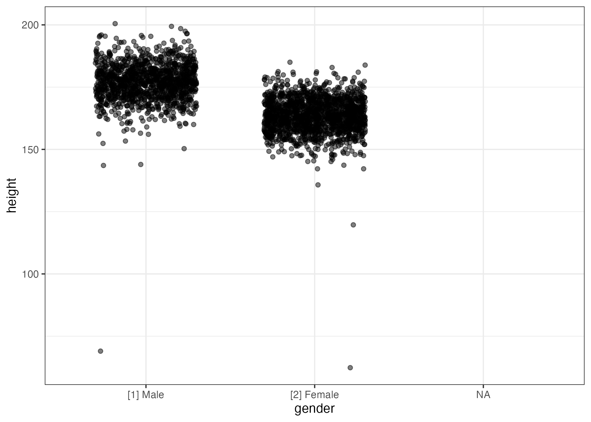
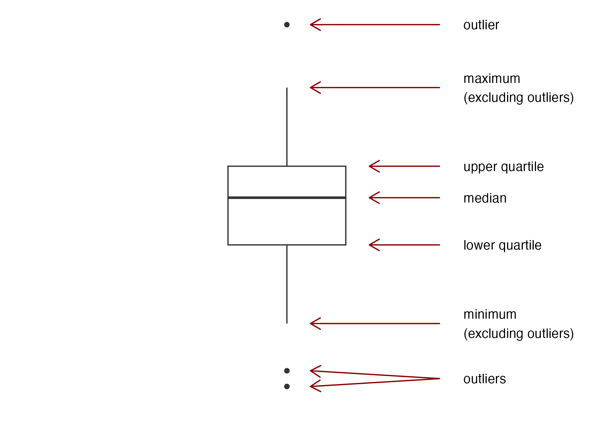

# (PART) Data Types and Descriptive Statistics {-}

# Before we get started...

This section is very minimal. I decided to go that route because 1) this is the "easiest" part of the material in the sense that there isn't a lot of things to really understand and think about, and 2) it is objectively speaking very, very, very boring... So, when you find my notes insufficient, take a look at Chapter 4 in [@ls]. 

**Learning Objectives**

1. Understand why descriptive statistics is important, and useful

2. Know the difference between discrete and continuous variables/data

3. Have some ideas of which summaries and figures are appropriate for different types of data


# Why Descriptive Statistics?

*Descriptive Statistics*, as the name implies, are about describing something. In general, we can only describe what we have at hand, so descriptive statistics only deal with the population in the very, very, very rare case when we have measured the entire population. It is way more common that descriptive statistics are about the sample at hand. 

Often when conducting an experiment, what we are actually interested in is using the sample we obtain to say something about the general population. If we, for example, enroll 200 patients in a study to find out if a new drug works, we're not *really* interested in whether or not it works for those 200 patients specifically, but more so if it works for any individual from the population in general. With that in mind, the whole concept of descriptive statistics might not seem very (1) exciting, (2) useful, or (3) necessary. While (1) is highly subjective, (2) very much so depends on the specific situation, there is little question that it is in fact necessary. 

Recall our general setup for any statistical analysis: we have some question about some feature of a population. To answer this question, we go get a sample of the population. If this is a good sample, the characteristics of this sample mimic those of the general population. If this is the case, then the hope is that we can draw conclusions about the sample, and generalize them to the general population. Conversely, if that is *not* the case, then no matter how convincing the evidence we find in the sample is for or against our hypotheses, it tells us nothing about the general population. 

```{r, general-population, echo = FALSE, engine = 'tikz', caption = "Recall the general setup: a sample is drawn from the population of interest."}
\begin{tikzpicture}
  \node[align=center] at (0,11) {\huge \bf Population};
  \draw [thick] (0,0) to [out=0, in=-90] (4.5,4)
                      to [out=90,in=-90] (3.5,8)
                      to [out=90,in=0] (2,10)
                      to [out=180,in=0] (0,9)
                      to [out=180,in=0] (-3,10)
                      to [out=180,in=90] (-5,7)
                      to [out=-90,in=90] (-4,5)
                      to [out=-90,in=90] (-5,2)
                      to [out=-90,in=180](0,0);

  \node[align=center] at (6.25,9) {\large SRS};
  \draw [thick,->] (4,8) to [out=25,in=155] (8.5,8);

  \node[align=center] at (10,11) {\huge \bf Sample};
  \draw [thick] (10,8.5) to [out=0,in=135] (11,8)
                         to [out=-45,in=100] (12,7)
                         to [out=-75,in=90] (12.5,5)
                         to [out=-105,in=0] (11.25,4)
                         to [out=180,in=0] (9.5,4.25)
                         to [out=180,in=0] (8.5,4)
                         to [out=180,in=-90] (8,4.5)
                         to [out=90,in=-90] (8.25,5.25)
                         to [out=90,in=-165] (8.5,7.5)
                         to [out=0,in=180](10,8.5);

\end{tikzpicture}
```

So how do we make sure the sample is representative of the population? The first step is to make sure our sampling scheme is good. Ideally, we sample completely at random, meaning that every single individual in the population has the same chance of ending up in the sample. As you might be able to guess, this is rarely the case, but if the sampling is done right it is either approximately true, or the sampling is done in a way that any biases introduced can be accounted for in the analysis.^[**Full disclaimer**: sampling is hard. As in really, really, really hard. Very smart people spend a lot of time on making sure different sampling schemes work. It is well beyond the scope of this course, and me, how the details of this work out.] Most commonly, sampling is done in such a way that the "equal chance" assumption isn't too crazy. But how do we know if this is actually the case? 

The truth is, we don't really. What we can do, though, is describe the sample we obtain. That way we can make sure we don't generalize any results to an inappropriate population. Historically, this mistake has been made over and over again in medical research when excluding women and ethnic minorities from studies.^[See @liu_womens_2016 for a more thorough discussion of the exclusion of women in particular.] For this particular reason, producing descriptive statistics is often the first step in any data analysis.

The rest of this section will go through different types of data, and show how we, in each case, can describe (or summarize, if you will) the specific type of data. 

In general, when we talk about data we often refer to *variables*. Variables are simply (and very vaguely) *things we measure*. You will see examples which hopefully helps understand exactly what is meant by a variable. 


# Discrete Data {#discrete}

A variable is called a *discrete* variable if the possible values of the variable are countable, that is if you can count them. Note that a discrete variable can technically have an infinite number of possible outcomes. 

A discrete variable is of one of two subtypes: *categorical* or *ordinal*.
 
## Categorical data {#categorical}

Categorical variables are discrete variables with no particular ordering of the categories.

### Examples -- categorical data

The classical example of a categorical variable is sex. For each subject, the value of this variable is one of two possible values: male or female. 

Other examples:

* color
* race
* blood type
* country of origin
* political orientation

### Binary/Dichotomous Data

Often researchers will refer to certain variables as *binary* or *dichotomous*. This simply means *categorical with two categories*.

## How to describe categorical data

Categorical variables are often described using *frequency counts* and *relative frequencies*. 

*Frequency counts* (or simply *frequencies*) are found by counting how many times each possible value is present in the data. *Relative frequencies* are found by dividing the frequency by the total number of observations. 

### Examples

Below are the frequencies for some categorical variables in the SHOW data set. One thing that often comes from this preliminary step of a data analysis is the realization that there are some kinks in your data. For example, notice how there are missing values for most of these variables (denoted by NA -- "Not Available").

```{r}
library(janitor)
SHOW_cat_freqs <- full_show %>% 
  select(gender, edu, marital, race) %>% 
  gather(key = "Variable", value = "Value") %>% 
  split(.$Variable) %>% 
  map(function(x){
    tmp <- x %>% 
      tabyl(Value) %>% 
      rename(Frequency = n,
             `Relative Frequency` = percent) %>% 
      select(-valid_percent) %>% 
      mutate(order = str_extract(Value, pattern = "\\[.+\\]") %>%
               str_remove_all(pattern = "\\[|\\]") %>% 
               as.numeric()) %>% 
      arrange(order) %>% 
      select(-order)
  })

SHOW_cat_freqs %>% 
  map(~ .x %>% 
        select(Value, Frequency)) %>% 
  pander::pander()
```

We can add relative frequencies to this simply by dividing each frequency by the total number of observations. You can check a few of them yourself -- simply divide the frequency by the total number of observations (found on the last line of the table). 

```{r}
SHOW_cat_freqs %>% 
  pander::pander()
```


Relative frequencies are useful when trying to compare the values of a specific variable across groups. Say we want to investigate if there are any differences in the marital status between genders in this cohort. We could consider the frequency of marital status stratified by gender:

```{r}
full_show %>% 
  tabyl(gender, marital) %>% 
  adorn_percentages() %>% 
  adorn_rounding(digits = 3) %>% 
  adorn_totals(where = "col") %>% 
  adorn_ns() %>% 
  pander::pander()
```

The table above shows the relative frequencies of marital status within each gender (frequency counts in parentheses). So we can see that the relative frequencies of men and women in the different groups are very close to each other. If you just look at the raw frequencies, this would not be obvious. 


## Ordinal Data

An *ordinal variable* is a discrete variable where the groups can easily be ordered in a meaningful sense. We won't distinguish between ordinal variables and categorical variables in this class, but there are methods out there that try to incorporate the extra information from ordinal data that you lose if you treat it as categorical data. 

### Examples 

* age groups
* disease severity scales

## How to visualize discrete data

Discrete data is often best presented using a bar chart of either frequency counts or relative frequencies. 

### Bar Charts

Below is a bar chart of the frequency counts of the marital status varaible from the SHOW data. 

```{r}
marital_hist <- ggplot(full_show, aes(x = marital)) + 
  geom_bar(width = 0.75) + 
  labs(x = 'Martial Status', y = "Frequency Counts") +
  scale_y_continuous(limits = c(0, max(table(full_show$marital))) + c(0,3), 
                     expand = expand_scale(mult = c(0, 0.1), add = c(0,0))) + 
  theme_bw() + 
  theme(axis.text.x = element_text(angle = 45, hjust = 1))

marital_hist %>% 
  plotly::ggplotly()
```

This can easily be turned into a bar chart of the relative frequencies. 

```{r}
show_martial_rel <- ggplot(full_show, aes(x = marital)) + 
  geom_bar(aes(y = ..count../sum(..count..)), 
           width = 0.75) + 
  scale_y_continuous(limits = c(0,1), 
                     expand = c(0,0)) +
  labs(x = 'Martial Status', y = "Relative Frequency") + 
  theme_bw() + 
  theme(axis.text.x = element_text(angle = 45, hjust = 1))

plotly::ggplotly(show_martial_rel)
```


# Continuous Data {#continuous}

A *continuous variable* is a numerical variable that can (at least theoretically) take on an infinite and uncountable number of possible values. 

## Examples

* age
* height
* speed
* blood pressure
* heart rate

## How to describe continuous data

When dealing with continuous data, we are often interested in two aspects: 

1. location
2. spread

### Location

The location of continuous data is often described by one of two metrics: the *mean* (or *average*) and the *median*. For completion, these are briefly defined below. For a more in-depth discussion of the mean and the median, see [@ls] pages 50-57

#### Mean 

The *mean* of a variable measured in a sample is also referred to as the *sample mean* or *average*. It is simply calculated as the sum of all observed values divided by the number of values. If we are interested in a variable $X$, the average is denoted $\bar{X}$ (read "$X$ bar"). So $\bar{X} = \frac{1}{n}\sum_{i=1}^n X_i$.^[If you are not familiar with this notation, fear not: it simply means "sum up all values of $X$". I.e., $\sum_{i=1}^n X_i = X_1 + X_2 + X_3 + ... + X_n$.] 

#### Median

The *median* is the middle point of the data. It is found by writing down all observations in order, then eliminating the most extreme pair (i.e. the smallest and largest values). Repeat until only one observation, or one pair of observations, is left. If you're left with one observation, congratulations, you found the median. If you're left with a pair, the median is the average of the two. 

#### Other location related metrics

Sometimes we are interested in the most extreme values we can expect of a value. Here it would be of interest to find the *minimum* and *maximum* of the variable. 

More generally, the minimum, median, and maximum values are examples of what is called *quantiles*. A quantile is a number that "cuts off" a certain proportion of the data (from the bottom). You can think of the median as the number that "cuts off" half the data. Therefore the median is also called the 0.5 quantile. The minimum is the 0 quantile (it cuts off nothing of the data), and the maximum the 1 quantile (it cuts off all the data). The most commonly used quantiles are the *quartiles*. This is the set of numbers that cut the data into four equally sized pieces. I.e. the 0.25, 0.5, and 0.75 quantiles are collectively known as the quartiles. These can be useful when talking about the location of the data, since indicating the 0.25 and 0.75 quantiles tells you where half the data is located -- namely between those two values. The quartiles are also often referred to as $Q_1, Q_2$, and $Q_3$. 

### Spread

Once we have an idea of the location of a continuous variable, the next natural question is how large the spread (or variation) is. 

We will here briefly introduce four (but kind of only three...) metrics for the spread of the data: variance, standard devaition, range, and interquartile range. 

#### Variance/Standard Deviation

The *variance* of a continuous variable is in many ways "the average (squared) deviation from the mean". It is calculated as $\Var(x) = \frac{1}{n-1} \sum_{i=1}^n (x_i - \bar{x})^2$. So larger variance means larger spread, and vice versa.

The *standard deviation* is simply the square root of the variance: $\SD(x) = \sqrt{\frac{1}{n-1} \sum_{i=1}^n (x_i - \bar{x})^2}$. Therefore, there's a one-to-one correspondance between the variance and the standard deviation. This also means that when the standard deviation is large, so is the spread. 

A natural question is then: why do we need both? The variance is nice for mathematical reasons, as we will see later. It also provides this nice interpretation as an average, which we lose when converting to the standard deviation (because of taking the square root). On the other hand, the standard deviation is nice because it kind of encapsulates the same idea as the variance, but preserves the unit. We'll have a more detailed discussion of this in later sections. 

#### Range

The *range* is simply the difference between the largest and the smallest value. Hopefully it is clear that this indeed is a measure for how spread out the data is. But it is not always a super useful measure -- you could have a sample where 293 observations are the exact same, and the last two observations are very, very different. In such a case, the range will indicate quite the spread, while in truth the data is not spread out very much at all. 

#### Interquartile Range (IQR)

The interquartile range is simply the difference between the first and the third quartile. I.e. $\text{IQR} = Q_3 - Q_1$. This is also the size of the box in a box plot (see section \@ref(boxplots)). 

## How to visualize continuous data

My favorite graphs to use with continuous data are scatter plots, boxplots, and histograms.

### Scatter Plots

A scatter plot is only really useful when you are considering the relationship between two variables where at least one is continuous. For example, consider the variables `height` and `weight` from the SHOW data. A scatter plot shows potential relationships between the two. Unsurprisingly, it seems that there is a positive correlation between the two -- i.e. when one goes up, so does the other. 

```{r}
scatter_height_weight <- full_show %>% 
  ggplot(aes(x = height, y = weight)) + 
    geom_point(alpha = 0.3)

ggsave(scatter_height_weight, filename = "figures/scatter_height_weight.png")

knitr::include_graphics("figures/scatter_height_weight.png")
```


You can also utilize scatter plots when one of the variables is categorical. For example, we could be interested in the relationship between height and gender. 

```{r}
scatter_gender_height <- full_show %>% 
  ggplot(aes(x = gender, y = height)) + 
    geom_point(alpha = 0.5)

ggsave(scatter_gender_height, filename = "figures/scatter_gender_height.png")

knitr::include_graphics("figures/scatter_gender_height.png")
```

In this case, it can be beneficial to add a bit of jitter to the plot in the direction of the categorical variable.

```{r}
jitter_gender_height <- full_show %>% 
  ggplot(aes(x = gender, y = height)) + 
    geom_jitter(height = 0, width = 0.3, alpha = 0.5)

ggsave(jitter_gender_height, filename = "figures/jitter_gender_height.png")


```

Even with a bit of jitter, it might be really hard to make anything of a scatter plot in this case, simply because we have "too much" data. In such a case, a boxplot might be a better choice. 

### Boxplots

Boxplots are great when you have a lot of data. They show the data through a set of summaries, namely the quartiles, and indicates if there are any *outliers*. Below are boxplots for the height of the SHOW population by gender. 

```{r}
boxplot_gender_height <- full_show %>% 
  filter(!is.na(gender), !is.na(height)) %>% 
  ggplot(aes(x = as.character(gender), y = height)) + 
    geom_boxplot() + 
    scale_y_continuous(limits = c(0, NA)) + 
    labs(x = 'Gender')

plotly::ggplotly(boxplot_gender_height)
```

You can use the figure below to decipher the box plot:

```{r boxplot_explanation}
boxplot_explanation <- ggplot(data = data.frame(y = c(1,2,5,10,10,10,11,13,13,13,15,15,15,15,16,20,24)),
       aes(x = 1, y = y)) + 
  geom_boxplot(width = 0.5) + 
  geom_text(data = data.frame(y = c(1.5,5,10,13,15,20,24),
                               labels = c("outliers", "minimum\n(excluding outliers)",
                                          "lower quartile", "median", "upper quartile", 
                                          "maximum\n(excluding outliers)", "outlier")),
            aes(x = 1.75, label = labels),
            hjust = 0) +
  geom_segment(data = data.frame(y = c(1.5,1.5,5,10,13,15,20,24),
                                 yend = c(1,2,5,10,13,15,20,24)),
               aes(x = 1.65, xend = c(1.1, 1.1, 1.1, 1.35, 1.35, 1.35, 1.1, 1.1),
                   y = y, yend = yend),
               arrow = arrow(length = unit(0.03, "npc")),
               color = 'darkred') +
  theme_minimal() +
  labs(x = '', y = '') +
  scale_x_continuous("", limits = c(0,2.2)) +
  theme(panel.grid = element_blank(),
        axis.text = element_blank())

ggsave(boxplot_explanation, filename = "figures/boxplot_explanation.png")


```

As you see on the boxplots of the SHOW data, it is a great tool to visualize continuous data when you have a lot of it. In a simple figure we can see that 

* the median height is greater for men than women
* there is generally a shift upwards for men compared to women
* the 75% tallest men are all taller than 75% of women (compare the bottom of the box for men with the top of the box for women)

and much more. 

One thing I haven't told you is the answer to a very important, very hard question: "how do we decide if a data point is an outlier?" We will simply adopt the practice that a data point is an outlier if it is more than 1.5 times the range of the box from the box. I.e. an observation is an outlier if it is greater than $Q_3 + 1.5\cdot (Q_3 - Q_1)$ or less than $Q_1 - 1.5\cdot (Q_3 - Q_1)$. 

### Histogram

At first, the *histogram* looks a lot like a bar chart, but there are a few very important differences. Before we go into details, lets take a look at a histogram. Below is a histogram of the depression scores in the SHOW data set.

```{r}
bmi_hist <- full_show %>% 
  ggplot(aes(x = bmi)) +
    geom_histogram(binwidth = 5, boundary = 0) + 
    #coord_cartesian(xlim = c(20, 30))
    scale_x_continuous(breaks = seq(0, 175, by = 10),
                       minor_breaks = seq(0, 175, by = 1)) +
    scale_y_continuous(expand = expand_scale(mult = c(0,0), add = c(0,20))) 

plotly::ggplotly(bmi_hist)
```

The main differences from a bar chart is that 

1. there are no gaps on the x-axis
2. the *relative area* of a bar is the proportion of your sample that falls in the interval corresponding to that bar

Later on, we will use the histogram to answer questions like "what is the probability a randomly chosen individual from the SHOW population has a BMI greater than 40?" or "between 20 and 30?" etc. This is simply done by dividing the area of the bars that are specified (for example all bars with BMI greater than 40) with the total area. 

The histogram will be **super** important to us moving forward, so make sure you know how to decipher it!


# Grey areas

An example of a variable that could easily be mistaken as categorical is age. Often when we think about age, we think about this in terms of years, or months, or even days. In that sense, age is a variable with a number of possible values that we could technically count -- start with 0, 1, 2, 3, ..., 55, 56, 57, ... . However, this is NOT the natural structure of the variable, but rather a limitation of the way it is measured and recorded. Technically, age is the time from birth till now, which if we could measure it with *infinite* precision, could be any possible number^[positive, real number, for those of you who want to be specific] you can think of.

Many other examples could be provided. In general, what's important to think about is the nature of the variable rather than what is measured. By nature, any measurement is going to be discrete, but some variables are continuous in nature. 


<!-- This manuscript was prepared using the PECARN Core Data Project (PCDP) 2002-2014 (STUDY) Data Set obtained from UTAH, and does not necessarily reflect the opinions or views of the STUDY investigators or the Health Resources Services Administration (HRSA) Maternal Child Health Bureau (MCHB) Emergency Medical Services for Children (EMSC). The PECARN was funded by the HRSA/MCHB/EMSC. -->

