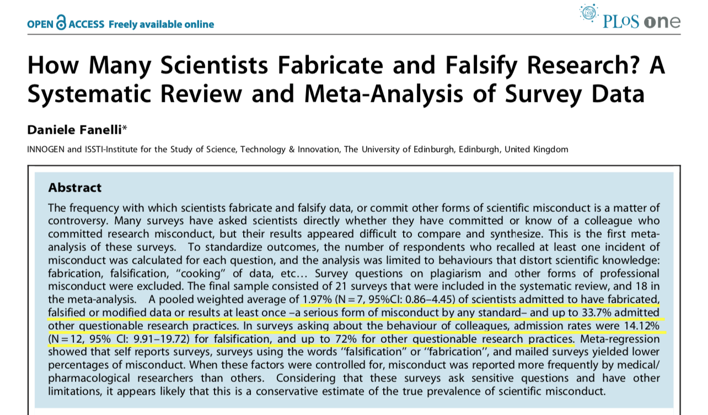

layout: true

```{r include = FALSE}
knitr::opts_chunk$set(echo = FALSE, warning = FALSE, message = FALSE)
```

# Welcome!

---

## Practicalities

Office hours: Wednesdays 11am till noon in PHS 666 (WARF 6th floor)

```{r echo = FALSE, out.width = 800, out.height = 350}
library(leaflet)
leaflet() %>% 
  addProviderTiles(provider = "Esri.WorldImagery",
                   options = tileOptions(minZoom = 2,
                                         noWrap = TRUE)) %>% 
  addPopups(lng = c(-89.430528, -89.426106, -89.407260, 11.324524), 
            lat = c(43.077731, 43.076249, 43.074241, 55.257877), 
            popup = c("We're here.", "WARF", "MSC", "Denmark!"),
            options = popupOptions(closeButton = FALSE,
                                   closeOnClick = FALSE)) %>% 
  setView(lng = -89.426106, lat = 43.076249, zoom = 15)
```

---

## Practicalities

Office hours: Wednesdays 11am till noon in PHS 666 (WARF 6th floor)

Lecture notes will be hosted [here](https://rmtrane.github.io/PUBLHLTH_783_biostats_notes/)

Updated as we go with some material available before lectures, some after

Lecture slides will be available on Canvas _after_ lectures

---

## Expectations

You can expect that I will ...

... be brutally honest

... do everything I can to keep things interesting

... fight for you!

--

In return, I expect that you will...

... help me out by participating in lectures (i.e. ask me all your question, answer all my questions)

... show up prepared when I ask that of you

... give me a chance!

???

* There will be times where we need to talk about stuff that's boring/uninteresting/not really relevant anymore. Also, bad practices still in play...
* Things are just more fun when there's interaction + it helps me help you
* Sometimes I will ask you to read things **BEFORE** lecture. I ONLY do this when it really makes sense, i.e. helps improve lecture or I believe it helps you understand the material better

---
layout: false

# Before we get started...

... let's clear the air. Based on my personal experiences
--
 most of you think statistics is boring.
 
--

.center[

]

---

# Before we get started...

... let's clear the air. Based on my personal experiences most of you think statistics is boring.
 
Give me a shot: I will try to make this different than most statistics classes. 

Take a leap of faith...

.center[

]

... I promise you won't get hurt!


---
layout: false

# Objectives for Today

1. "Define" statistics

2. Better understanding of what statistics is/isn't

3. Why is statistics important?

4. Broad overview of statistics in 783


---

# What is Biostatistics?

Statistics applied to biology related questions

* Average Age of Death in 1842 Great Britain

|               | Manchester | Rutland |
|:-------------:|:----------:|:-------:|
| Professionals |     38     |    52   |
| Tradesmen     |     20     |    41   | 
| Laborers      |     17     |    38   |


* Are there genes associated with an increased risk of cancer?

* What are common factors of increased risk of cardiovascular disease?

* Does exposure to green spaces improve mental health?

--

So the question really is: what is statistics?

???

Saw this example on Tuesday. 

How do we know what the average age of death is?

Well known that if BRCA is overexpressed it increases the risk of breast cancer. How? 

So what is Statistics? 

---

# What is Statistics?

Statistics is... 
--
very hard to define. 

--

From Wikipedia: 

.center[

]

--


So it seems that statistics is everything that has to do with data...?


???

Therefore, if you think about it, a lot of what Kristen talked about on Tuesday was actually statistics in disguise. 

---

# What is Statistics?

<div class="middlecenter">
  STATISTICS IS NOT AN EXACT SCIENCE!!
</div>

--

It is more accurately described as a *decision science*.

--

Very unfortunate misconception. Lead to terms as "statistically significant", arbitrary cutoffs used as THE way to determine importance, etc. 

???

Much, much more than means, and standard deviations. That's the boring stuff...

Stats is not MATH

---
layout: true 

# Why you should care

---

These days, statistics is all around us, but most have problems with even simple things, such as interpreting a probability.

--

.center[
  
]

---

Too often studies are misrepresented.

.center[
  
]

--

.center[
  
]


---

People get away with bad practices (on purpose or accidentially): 

.center[
  
  
  Full paper (from 2009) can be found [here](https://www.ncbi.nlm.nih.gov/pmc/articles/PMC2685008/)  
]

???

This wouldn't happen as often if more people were "statisitcally literate"

---

</br>

</br>

</br>

</br>

My point is: whether you'll be producers or consumers of statistics, it's important to have a basic understanding of what's going on.

---
layout: true

# Biostatistics in PUBLHLTH 783

---

In the begining, there is a hypothesis: "Cigarette smoking causes lung cancer".

--

* Very vague, hard to verify or dismiss

--

More specific: "People who smoke cigarettes have a higher incidence of lung cancer over a 10-year period than people who do not smoke cigarettes."

--

* Clear what it means to "cause lung cancer" -- higher incidence 

--

* However, it is **NOT** clear what "higher" means

---

Say we wanted to answer this question. Only one way to obtain the "Truth&trade;". It's a simple three-step procedure:

--

1. Ask the people in your population of interest if they have ever smoked, and if they have developed lung cancer. 

--

2. Calculate incidence rates

--

3. See which is larger

--

.center[
Rejoice in newfound knowledge!


]

---

Say we wanted to answer this question. Only one way to obtain the "Truth&trade;". It's a simple three-step procedure:

1. Ask the people in your population of interest if they have ever smoked, and if they have developed lung cancer. 


2. Calculate incidence rates

3. See which is larger

.center[
Unfortunately, this is basically impossible!


]

---

What do we do instead? Statistics! 

--

1. Define the population(s) you're interested in, and specify the feature you'll be looking at
  - populations are people who smoke, and people who do not
  - feature of interest would be incidence rate

2. Get a representative sample from the population
  - preferably sample by random from the two populations

3. From the sample, calculate quantities that help you say things about the "truth"
  - when interested in the incidence rate, simply calculate the incidence rates in the samples

--

The thing is, the samples won't mirror the populations *exactly* -- take a new sample, get new estimates of incidence rates.

--

The question is then: is the difference due to "differences in the truths", or is it simply "differences due to random samples"?

???

- The "fundamental assumption" of statistics: there is a "truth" in the population
- The "fundamental idea" of statisitcs:  take sample, work with sample, if sample is similar to population we can do inference
- If the difference is "big enough", fair to say it is due to differences in the truths

---

## Example: Average age of death in Wisconsin

(Inspired by the "Average Age of Death (1842)" example)

Where should you live 

1. Populations of interest: people living in Wisconsin broken down by county. Feature: mean age of death

2. Use public records to get age of death for a good sample of people

3. What would be a good quantity to look at in the sample?
--
 probably the average age of death

---

Results according to [this report](https://www.dhs.wisconsin.gov/publications/p01551.pdf): 

| County      | Life expectancy |
|:-----------:|:---------------:|
| Kewaunee    | 82.0 | 
| Ozaukee     | 81.8 |
| Pierce      | 81.6 |
| Waukesha    | 81.5 |
| Taylor      | 81.5 |
| Milwaukee   | 77.6 |
| Washburn    | 76.7 |
| Ashland     | 77.5 |
| Sawyer      | 77.1 |
| Menominee   | 72.5 |


--

Would you prefer Kewaunee over Waukesha?

???

* Not everyone dies at the same age, so we'll be thinking about the mean age

* Clearly rather live in Kewaunee than Menominee. But would you prefer Kewaunee over Waukesha?

---

The question is: do we *really* think there's a difference? 

--

Let's pretend the results of the actual data looked like this:

```{r echo = FALSE, results = "asis", fig.width = 4, fig.height = 4, fig.align='center'}
library(tidyverse)
n <- 100
set.seed(1011)
made_up_life_exp <- tibble(county = rep(c("Kewaunee", "Waukesha"), each = 2*n),
                           experiment = rep(c(1,2), 2*n),
                           mean = if_else(county == "Kewaunee", 82, 81.5), 
                           sd = case_when(experiment == 1 & county == "Kewaunee"~ 5, 
                                          experiment == 1 & county == "Waukesha"~ 2, 
                                          experiment == 2 ~ 0.1)) %>% 
  group_by(county, experiment) %>% 
  mutate(`Age of Death` = rnorm(n = n, mean, sd),
         group_mean = mean(`Age of Death`)) %>% 
  ungroup() %>% 
  mutate(`Age of Death` = `Age of Death` - (group_mean-mean))
  

made_up_life_exp_table <- made_up_life_exp %>% 
  group_by(county, experiment) %>% 
  summarise(n = n(), 
            `Average Age of Death` = mean(`Age of Death`))

made_up_life_exp_table %>% 
  filter(experiment == 2) %>% 
  select(-experiment) %>% 
  knitr::kable(format = 'html')

ggplot(made_up_life_exp %>% filter(experiment == 2),
       aes(x = county, y = `Age of Death`)) + 
  geom_jitter(alpha = 0.75, width = 0.25) + 
  theme_bw()
```

Would you prefer Kewaunee?
--
 I definitely would...

---

What if the actual data look more like this:

```{r echo = FALSE, results = "asis", fig.width = 4, fig.height = 4, fig.align='center'}
made_up_life_exp_table %>% 
  filter(experiment == 1) %>% 
  select(-experiment) %>% 
  knitr::kable(format = "html")

ggplot(made_up_life_exp %>% filter(experiment == 1),
       aes(x = county, y = `Age of Death`)) + 
  geom_jitter(alpha = 0.75, width = 0.25) + 
  theme_bw()
```

Would you prefer Kewaunee?
--
 I'm not sure...

---

The main question: when is a difference "big enough"? How do we make the answer less subjective?

???

Note: less subjective, not objective!

---

## Components

1. Descriptive Statisitcs

2. Probability

3. Inference

---

## 1. Descriptive Statistics

Q: Why is it important to describe your sample?

A: Can only draw conclusions about population that looks like your sample

--

.center[


]

Moral of the story: know your population!

??? 

Other examples: medical research excluding minorities.

Super important, but....... super boring.

---

## 2. Probability

Describes what happens when getting a sample from a population.

*Probability Theory* is a branch of mathematics that plays a crucial role in statistics

This is what enables us to describe the variability of sampling

--

## 3. Inference

The art of extrapolating from a sample to the population.

SUPER HARD!

To make it easier, we make assumptions. 

This also means that if our assumptions are off, everything is off. Therefore, important to state **AND** check your assumptions!

???

This is where decisions come into play. Subjective what assumptions you're willing to accept, and checking assumptions is often very hard and very subjective 


---

## Work Flow:

* Want to test hypothesis

* Take sample from population

* Calculate quantity of interest

* Ask: *IF* the hypothesis is true, how likely are we to see what we saw

    - If unlikely, evidence **against** the hypothesis
    - If likely, evidence **for** the hypothesis

* Answer: get an idea of how much the observed quantity is expected to vary, then use probability theory?

 
???

This is where decisions come into play. Subjective what assumptions you're willing to accept, and checking assumptions is often very hard and very subjective 

How do we get an idea of how much would the quantity would vary with repetition? 

