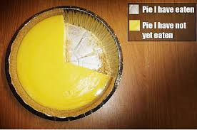

```{r include = FALSE}
knitr::opts_chunk$set(echo = FALSE, warning = FALSE, message = FALSE, dpi=300)

options(DT.options = list(scrollX = TRUE))

library(tidyverse)
library(viridis)

## Set theme for plots (only works when you load ggplot2, which can be done using library(ggplot2) OR with library(tidyverse))
theme_set(theme_bw())

scale_color_continuous <- function(...) scale_color_viridis_c(...)
scale_fill_continuous <- function(...) scale_fill_viridis_c(...)

scale_color_discrete <- function(...) scale_color_viridis_d(...)
scale_fill_discrete <- function(...) scale_fill_viridis_d(...)

framingham <- read_csv("../../data/Framingham/framingham.csv") %>% 
  rename(gender = male) %>% 
  mutate(gender = if_else(gender == 1, 'male', 'female'))

```

# Learning Objectives

1. Understand why descriptive statistics is important, and useful

2. Know the difference between discrete and continuous variables/data

3. Have some ideas of which summaries and figures are appropriate for different types of data


---

# Descriptive Statistics

* What: the art of describing data with few important measures ('summary statistics')

* Why: 
    - know your population!!
    - explore your data

* How: try to get an idea of the distributions of variables included 
--

    - what's a distribution?!
    - what's a variable?!

???

* What: when doing big studies, you collect lots of data. Take the essense of the data, summarize it in a few summary statistics, present it to the audience.

* Why: 
    - the sample is supposed to be representative of the population. Describe the sample to know what population you MIGHT be able to generalize to
    - often find things -- data entry errors, potential confounding variables, potential associations

* How: use numbers and especially figures to describe the distribution
    - what's a distribution? Next week
    - what's a variable -- today.

---

# Data Types

Two general data types: 

* Discrete data
    - categorical
        - no natural ordering
        - examples: sex, race, blood type, political orientation, etc. 
    - ordinal
        - naturally ordered
        - educational level, age groups, disease severity scales, etc.
    - summarized by 
        - frequency counts
        - relative frequencies
        
* Continuous data
    - numerical
        - examples: age, height, weight, BMI, proportions, etc.
    - infinite (uncountable, actually...) number of potential values
    - summarized by
        - location measures
        - spread/variation measures

---

# Example 

[Framingham Heart Study](./fhs_descriptives.html)


---
layout: true

# Quick Detour

---

What NOT to do with categorical data.

--

A.K.A. my least favorite chart of all time...

```{r fig.height = 2, fig.width = 4}
framingham %>% 
  mutate(education = if_else(is.na(education), 'NA', as.character(education))) %>% 
  janitor::tabyl(education, gender) %>% 
  janitor::adorn_percentages(denominator = 'col') %>% 
  gather(female, male, key = 'gender', value = 'rel_freq') %>% 
  ggplot(aes(x = '', y = rel_freq, fill = education)) + 
    geom_bar(stat = 'identity', width = 1) +
    coord_polar('y', start = 0) +
    scale_fill_viridis_d() + 
    facet_grid(~gender) +
    theme_void() + 
    theme(text = element_text(size = 20),
          legend.position = 'bottom',
          plot.margin=grid::unit(c(0,0,0,0), "mm"))
```

---

Why don't I like pie charts? 

.pull-left[

What we want from figures:

1. self-explanatory

2. important information should be easy to get

3. show trends (if available)

4. only as complicated as the data

5. free of unnecessary complexity
    - irrelavent decorations
    - 3D effects --(**BIG YIKES!!!!!**)

]

--

.pull-right[

The pie chart violates 2, 4, and 5. 

* 5: a bar chart is almost always more appropriate

* 2 and 4: pie charts compare angles. Humans are awful at comparing angles!

]

---

From [Wikimedia Commons](https://commons.wikimedia.org/wiki/File:Piecharts.svg)

For each of the following, rank the colors in terms of size:

```{r fig.height=2, fig.width=6}
pie_charts <- tibble(x = as.character(rep(1:5, 3)),
                     group = rep(1:3, each = 5),
                     values = c(17, 18, 20, 22, 23,
                                20, 20, 19, 21, 20,
                                23, 22, 20, 18, 17))

ggplot(pie_charts,
       aes(x = '', y = values, fill = x)) + 
  geom_bar(stat = 'identity') + 
  facet_grid(~group) +
  coord_polar('y', direction = 1) + 
  theme_void() + 
  theme(legend.position = 'none')
```

---

For each of the following, rank the colors in terms of size:

```{r fig.height = 2, fig.width = 6}
pie_charts <- tibble(x = as.character(rep(1:5, 3)),
                     group = rep(1:3, each = 5),
                     values = c(17, 18, 20, 22, 23,
                                20, 20, 19, 21, 20,
                                23, 22, 20, 18, 17))

ggplot(pie_charts,
       aes(x = x, y = values, fill = x)) + 
  geom_bar(stat = 'identity') + 
  facet_grid(~group) +
  labs(x = '', y = '') +
  theme(legend.position = 'none')
```

---


---

> "Only pie chart ever allowed:"
> 
.center[

]
>
> `r tufte::quote_footer('--- Me (24/9/2019)')`

--

That was two days ago, though. Things change... I guess.

> "All pies might not be made equal.....
--
?"
>
> `r tufte::quote_footer('--- Me (25/9/2019)')`

--

Before using a pie chart, read [this](https://www.richardhollins.com/blog/why-pie-charts-suck/), [this](https://policyviz.com/2018/01/11/fk-it-lets-use-pie-charts/), and [this](https://academy.datawrapper.de/article/127-what-to-consider-when-creating-a-pie-chart). [This](https://twitter.com/maxcroser/status/857389434756505600) Twitter thread is also great!

---

