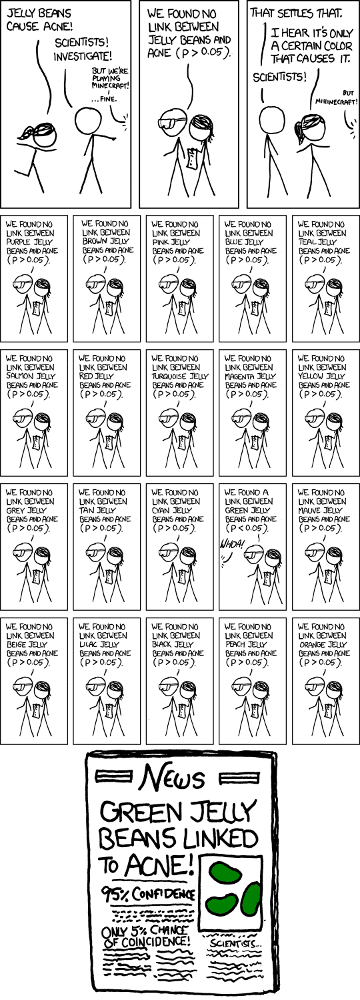
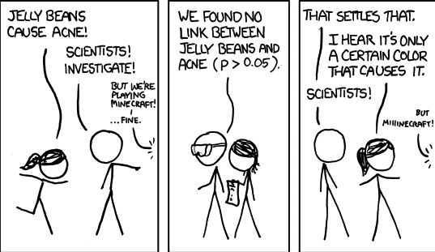
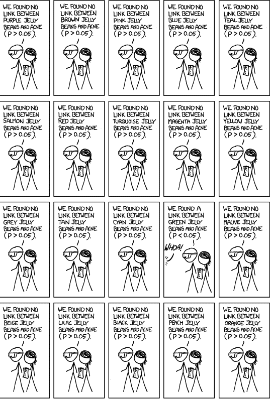

# Recap

Population of interest.

Get a representative sample. 

Make assumptions about the way the sampling works (i.e. the distribution of the data).

Set up hypothesis. 

Ask: "If the hypothesis is true, what is the probability of seeing data that are this far from the hypothesis?"

If probability is small, reject hypothesis. If probability large, do not reject hypothesis. 

(**NOTE**: we NEVER accept the null hypothesis.)

---

# Recap: Statistical Hypothesis Testing

(For simplicity, assume we're testing $H_0: \mu = 17$ vs. $H_A: \mu \neq 17$ at a $\alpha = 0.05$ level of significance.)

Get a sample

Calculate $t_{obs} = \frac{\bar{x} - 17}{\text{SD}(\bar{x})}$ 

Find $P\left(T > |t_{obs}|\ \left |H_0 \text{ is true}\right . \right)$. This is our p-value. Compare to significance level. If smaller, reject. If larger, do not reject. 

--

Can also ask: what value of $T$ will give us p-value smaller than $\alpha$? 

.center[
```{r echo = FALSE, warning = FALSE, message = FALSE, out.width = 300, out.height = 200, fig.width = 3, fig.height = 2, dpi = 300}
knitr::opts_chunk$set(echo = FALSE, warning = FALSE, message = FALSE, fig.align = 'center', dpi = 300)
library(tidyverse)
theme_set(theme_bw())

library(viridis)
scale_color_continuous <- scale_colour_continuous <- function(...) scale_color_viridis_c(...)
scale_color_discrete <- scale_colour_discrete <- function(...) scale_color_viridis_d(...)

scale_fill_continuous <- function(...) scale_fill_viridis_c(...)
scale_fill_discrete <- function(...) scale_fill_viridis_d(...)


theme_set(theme_bw())

ggplot(data = tibble(x = seq(-4, 4, by = 0.01)) %>% 
         mutate(y = dnorm(x = x)),
       aes(x = x, y = y)) + 
  geom_line() + 
  geom_vline(xintercept = c(-1.96, 1.96),
             color = 'red', linetype = 'dashed') + 
  geom_area(data = tibble(x = seq(-4, -1.96, by = 0.01)) %>% 
              mutate(y = dnorm(x)),
            aes(x = x, y = y), alpha = 0.6) + 
  geom_area(data = tibble(x = seq(1.96, 4, by = 0.01)) %>% 
              mutate(y = dnorm(x)),
            aes(x = x, y = y), alpha = 0.6) + 
  scale_y_continuous(expand = expand_scale(mult = c(0, 0.1))) +
  labs(x = 'Test statistic', y = '',
       title = 'Rejection Region -- we reject when is in grey')
```
]

What if $H_0$ is true, but we end up in grey anyway? Or what if $H_0$ is false, but we end up in white? 

---

# Errors we might make

Whenever you perform a hypothesis test, you might make a mistake

* Reject the null hypothesis when you shouldn't have

* Do not reject the null hypothesis when you should have

The first type of error is called type I error.

The second type of error is called type II error.

---

# Type I Errors

When you reject the null hypothesis, but in fact the null hypothesis is true. 

What is the probability of this happening? 

--

\begin{align*}
  P(\text{type I error}) &= P(\text{"far away"} | H_0 \text{ is true}) \\
                         &= P(T > |\text{critical value}| | H_0 \text{ is true}) \\
                         &= \alpha
\end{align*}

I.e. setting $\alpha$ means setting probability of type I error. So why don't we pick a super, super, super small $\alpha$?

---

# Type II Errors

Adjusting the probability of type I error affects the probability of type II error.


---

# Multiple Testing Problem

Probability of Type I error if we test one hypothesis: 0.05 (or, in general, $\alpha$)

What if we test more hypotheses? 

Assume they're independent, and we test $k$ hypotheses $H_1, H_2, ..., H_k$. Then

\begin{align*}
  P(\text{no type I error}) &= P(\text{do not reject any hypotheses} | \text{all hypotheses are true}) \\
    &= P(\text{do not reject } H_1 | H_1 \text{ is true}) \cdots P(\text{do not reject } H_k | H_k \text{ is true}) \\
    &= 0.95 \cdots 0.95 = 0.95^k.
\end{align*}

Probability of rejecting at least one hypothesis *IF* they are all true: $1 - P(\text{do not reject any hypotheses} | \text{all hypotheses are true})$.


```{r out.width = 325, out.height = 275, fig.width = 3.5, fig.height = 3, dpi = 300}
ggplot(data = data.frame(k = 1:25) %>% mutate(y = 1-0.95^k),
       aes(x = k, y = y)) + 
  geom_line() + 
  labs(y = 'Probability',
       title = 'Probability of making\nAT LEAST one false discovery') +
  ylim(c(0,1))
```

---

# Multiple Testing Problem

```{r out.height = 600}

```

---

# Multiple Testing Problem

```{r out.width = 600}

```

---

# Multiple Testing Problem

```{r, out.height = 400}

```

---

# Multiple Testing Problem

```{r fig.height = 400}

```

---

# Coming up next: Confidence Intervals

Imagine you test a range of different hypothesis. 

Confidence interval: the values that are NOT rejected. 


Hypothesis test: is it plausible this one value is the true value?

Confidence Interval: all plausible values.

--

So why would you ever perform a test, and report a p-value, but not a confidence interval? 
--
 Good question..............
