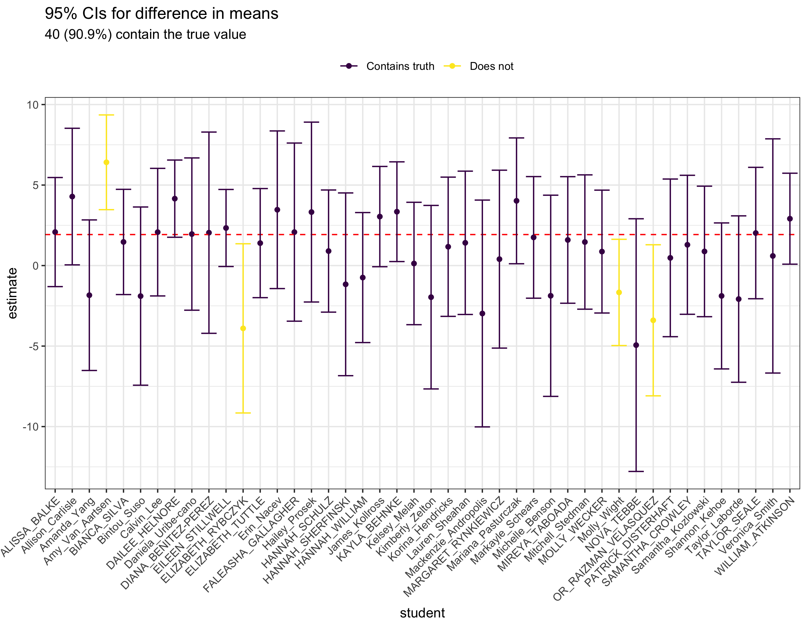
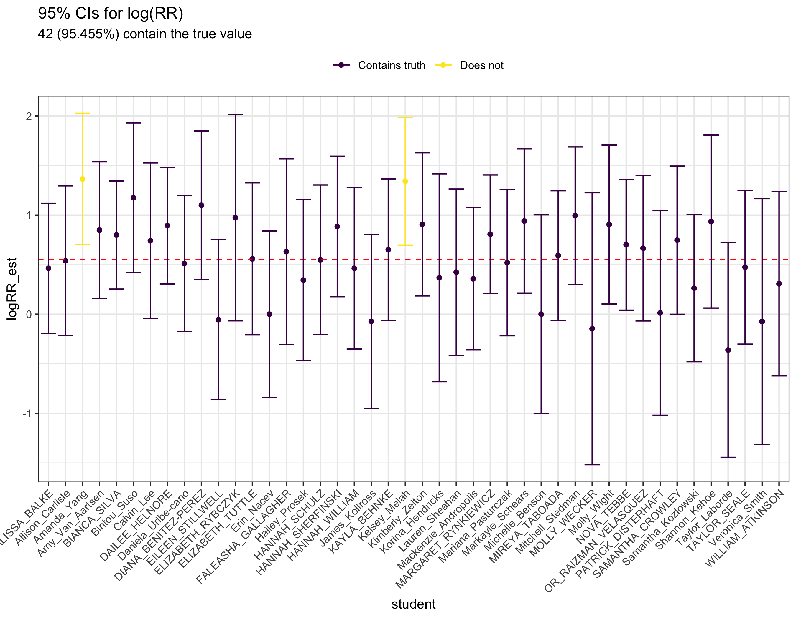
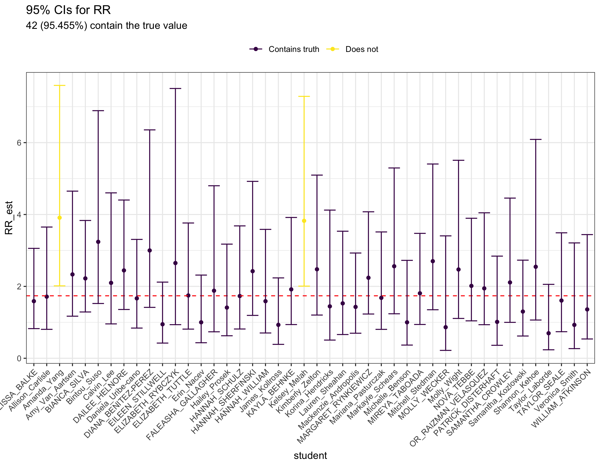
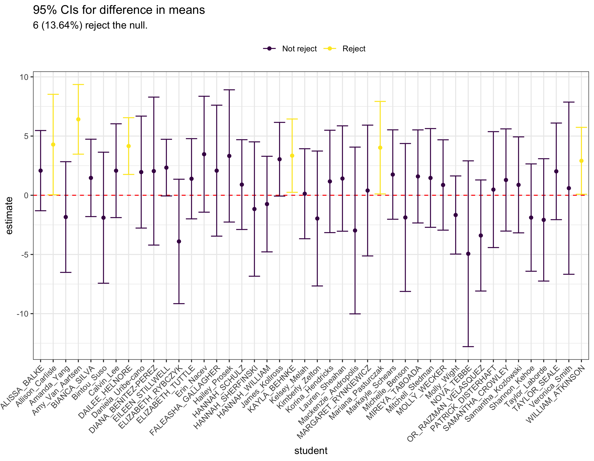
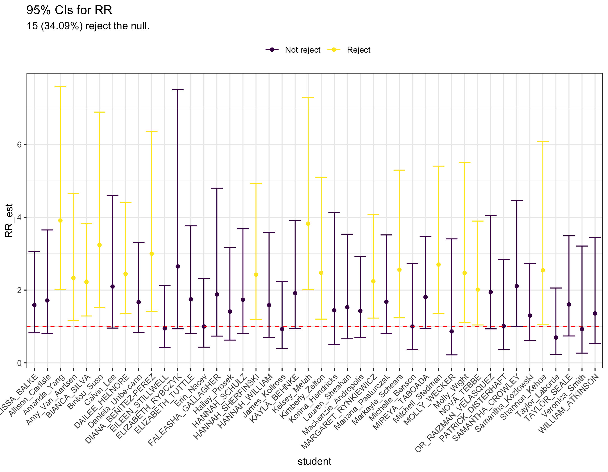

```{r include = FALSE}
knitr::opts_chunk$set(echo = FALSE, message = FALSE, warning = FALSE, out.height = "500px", out.width = "643px")

library(tidyverse)

RR <- function(x, exposure, outcome){
  exposure <- enexpr(exposure)
  outcome <- enexpr(outcome)
  
  x <- filter(x, !is.na(!!exposure), !is.na(!!outcome))
  
  x1 <- nrow(filter(x, !!exposure == 0, !!outcome == 1))
  x2 <- nrow(filter(x, !!exposure == 1, !!outcome == 1))
  n1 <- nrow(filter(x, !!exposure == 0))
  n2 <- nrow(filter(x, !!exposure == 1))

  RR_est <- (x2/n2)/(x1/n1)

  return(RR_est)
}

full_show_data <- haven::read_sas(paste0(here::here(), "/data/SHOW/SHOW_PHS.sas7bdat")) %>%
  transmute(depressed = if_else(PHQ_SEVERITY < 2, 0, 1),
            bmi = ANT_BMI,
            smoker = if_else(SMQ_DER_FORMER_NEVER_CURRENT == 1, 1, 0))

tests <- read_csv(paste0(here::here(), "/lectures/lecture09/tests.csv"))
```

layout: true

# Follow-up on lab

---

## Intro

You were all working with different data sets -- different samples of subjects from the SHOW population. 

I let you all pick your own research questions, but let us pretend for a second we were all looking at the same thing. 

Let's say we were all interested in the relationship between depression (outcome), and smoking status (binary exposure) and BMI (continuous exposure). 

I will walk through the steps here using the *entire population*. I.e. we will know the Truth<sup>TM</sup>! 

---

## Summary/descriptive tables in SHOW population

We see that there *is* indeed a difference between the mean BMI in the two groups. 

```{r}
full_show_data %>% 
  group_by(depressed) %>% 
  summarize(N = n(),
            `N not missing` = sum(!is.na(bmi)),
            Mean = mean(bmi, na.rm = T),
            SD = sd(bmi, na.rm = T),
            Var = var(bmi, na.rm = T)) %>% 
  knitr::kable(format = "html")
```

Remember, this is the entire population. I.e. in the SHOW population, there *is* a difference between the means. We do not have to do any sort of test, or consider the SD -- simply look at the means. 

---

## Summary/descriptive tables in SHOW population

```{r}
full_show_data %>% 
  janitor::tabyl(smoker, depressed) %>% 
  rename("Current Smoker \\\\ Depressed" = smoker) %>% 
  knitr::kable(format = "html")
```

True relative risk: $\frac{p_1}{p_0} = \frac{191/(191+254)}{446/(446 + 1360)} \approx `r round(RR(full_show_data, exposure = smoker, outcome = depressed), digits = 4)`$. There *is* a difference in the risk between people who have never smoked,

---

## Your results

Now that we know the Truth<sub>TM</sub>, we can evaluate how you would have performed. If you had all looked for these associations, how many of you would have gotten it right? 

For the association between BMI and depression status, we use a two-sample t-test to test the hypothesis $H_0: \mu_\text{depressed} - \mu_\text{not depressed} = 0$ against $H_A: \mu_\text{depressed} - \mu_\text{not depressed} \neq 0$.

For the association between current smoker and depression status, we test $H_0: RR = 1$ vs. $H_A: RR \neq 1$. 

---

## Your results: BMI vs Depression

--

.center[
```{r}

```
]

---

## Your results: Current Smoker vs Depression

--

.center[
```{r}

```
]


---


## Your results: Current Smoker vs Depression

--

.center[
```{r}

```
]

---

## Your results: how many would reject $H_0: \mu_\text{depressed} = \mu_\text{not depressed}$?

--

.center[
```{r}

```
]

---

## Your results: how many would reject $H_0: RR = 1$?

--

.center[
```{r}

```
]

---

## Your results: conclusion

* As expected, confidence intervals contain the true value most of the time

* However, we rarely reject the null *even though we should have*!

Why?

--

Lack of statistical power! How can this be fixed?

--

Increase sample size!

---
layout: false

# Power 

Power = probability of rejecting the null when the null is false. 

Power = $P(\bar{X} > z_{crit} \text{ OR } \bar{X} < -z_{crit} | H_0 \text{ is false})$.

In general, impossible to calculate, since when $H_0$ is false, we do not know the distribution of $\bar{X}$!

However, we can play yet another game of pretend...

Say: ***if*** the true value is $\mu_\text{true}$, what is our power? 

Exact calculations only possible for very simple tests. For more complex models, simulations are used.

---

# Power

```{r}
our_power <- pwr::pwr.t2n.test(n1 = 50, n2 = 50, d = 1.8/8)
```

So, what power did we have in our case? 

Best case scenario with sample size of 100 (i.e. 50/50 depressed/not depressed), the power would be $`r round(our_power[['power']], digits = 5)`$. 

So, only one in five experiments would correctly reject the null. 

The sample size in each group needed to achieve 80% power: $`r round(pwr::pwr.t.test(d = 1.8/8, power = 0.8)[['n']],digits = 0)`$. 

---

# Sample Size Calculations for Tests

Ask: what sample size is needed to obtain a certain power ***if*** the true mean is $\mu_\text{true}$?

Answer: often complicated, and sometimes only solvable through simulations. 

One case where it is possible: one sample z-test. 

In practice when looking for "statistically significant differences", "true mean" is replaced with "minimal detectable difference", which is often decided by the "clinically relevant difference". Basically, we say if the true difference is XX, we want to make sure we have a big enough sample to detect that difference. 

---

# Sample Size Calculations for CIs

Ask: what sample size is needed to obtain a certain width for your CI? 

Answer: in simple cases, such as CI for mean, this is fairly simple. 

--

\begin{align*}
  \text{Width} &= \text{upper limit} - \text{lower limit} \\
               &= (\bar{X} + z_\text{crit} \frac{\sigma^2}{\sqrt{n}}) - (\bar{X} - z_\text{crit} \frac{\sigma^2}{\sqrt{n}}) \\
               &= 2\cdot z_\text{crit} \frac{\sigma^2}{\sqrt{n}}
\end{align*}

So, 

$$
  n = \left(\frac{2\cdot z_\text{crit}}{\text{Width}}\right)^2.
$$

---

# Sample Size Calculations: Challenges

There's a nice overview in your book (can also be found [here](http://sphweb.bumc.bu.edu/otlt/MPH-Modules/BS/BS704_Power/BS704_Power9.html#headingtaglink_1)). 

What do you notice in the first three rows? 
--
 All depend on the *true* value of $\sigma$. 

Is this ever known to us? 
--
 Not quite.
 
In practice: either gather data from pilot study, or rely on previous experiments to estimate $\sigma$.

Is this a good solution? 

--

No, not at all. [This](https://www.sciencedirect.com/science/article/abs/pii/S0895435603001410) study showed that in 80% of reviewed articles the predicted standard deviation was smaller than the actual sample standard deviation.

I.e. when these studies began, researchers expected to have better power than what they actually ended up with. 

For more, check out [this](https://rtrane.shinyapps.io/power/) interactive presentation I created a few years ago. It's pretty cool...
